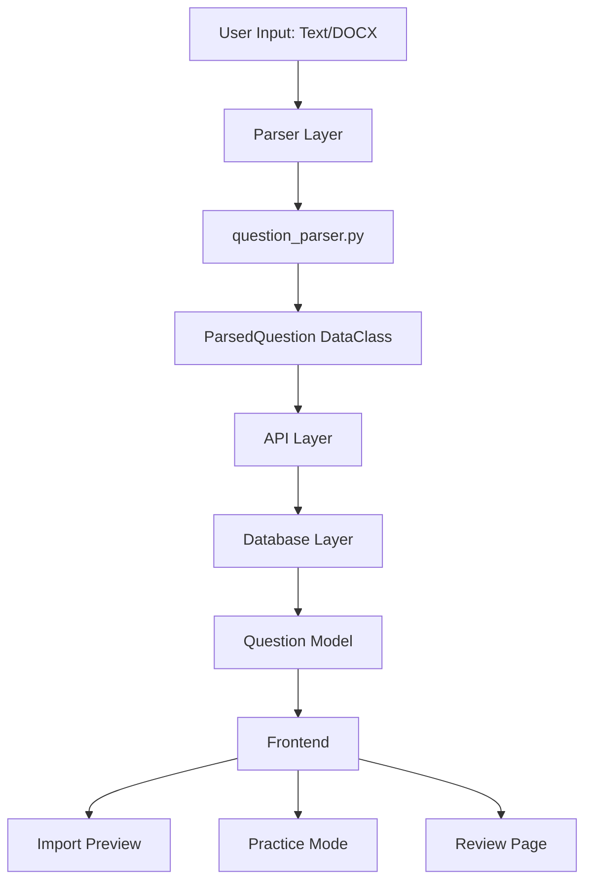

# Design Document: Question Explanations Import

## Overview

This feature extends the existing question import system to support optional explanation text for questions. The design prioritizes **minimal changes**, **backward compatibility**, and **extension over rewriting**. 

### Key Design Principles

1. **Extend, Don't Replace**: All existing parsing infrastructure (`question_parser.py`, `docx_parser.py`) will be extended, not rewritten
2. **Backward Compatible**: Questions without explanations continue to work exactly as before with zero changes
3. **Auto-Detection**: The system automatically detects whether a question has an explanation and handles both formats seamlessly
4. **Nullable by Default**: The `explanation` field is optional throughout the entire stack (database, API, frontend)
5. **Conditional Rendering**: UI only shows explanation sections when explanations exist

### Format Support

**Format A (Existing):**
```
Question 1
What is the time complexity of binary search?
A. O(n)
B. O(log n)
C. O(n²)
D. O(1)
Answer: B
```

**Format B (New):**
```
Question 1
What is the time complexity of binary search?
A. O(n)
B. O(log n)
C. O(n²)
D. O(1)
Answer: B
Explanation: Binary search divides the search space in half with each comparison, resulting in logarithmic time complexity.
```


## Architecture

### Component Overview



### Data Flow

1. **Input**: User provides text or DOCX file with questions (with or without explanations)
2. **Parsing**: `QuestionParser` detects format and extracts all fields including optional explanation
3. **Validation**: Parser validates explanation format when present (empty check, length check)
4. **Serialization**: `ParsedQuestion` serializes to dict including `explanation` field (null if absent)
5. **API Response**: Endpoints return questions with `explanation: null` or `explanation: "text"`
6. **Database**: Questions stored with nullable `explanation` column
7. **Frontend**: UI conditionally renders explanation sections only when `explanation !== null`


## Components and Interfaces

### 1. Database Layer

#### Question Model Extension

**File**: `backend/app/models/question.py`

**Changes**:
```python
# Add new column
explanation = Column(String, nullable=True)

# Update to_dict() method
def to_dict(self):
    return {
        # ... existing fields ...
        "explanation": self.explanation,  # Add this line
    }
```

**Migration**:
- Add nullable `explanation` column of type String
- No data transformation required (defaults to NULL)
- Preserves all existing question data

### 2. Parser Layer

#### QuestionParser Extension

**File**: `backend/app/utils/question_parser.py`

**Strategy**: Extend existing `_parse_single_question()` method to detect and extract explanation after parsing answer.

**New Pattern**:
```python
EXPLANATION_PATTERN = re.compile(r'^Explanation:\s*(.*)$', re.IGNORECASE)
```

**Parsing Logic**:
After successfully parsing the answer (line ~180 in current implementation):
1. Continue reading lines after "Answer:" line
2. Check each line against `EXPLANATION_PATTERN`
3. If match found:
   - Extract explanation text (everything after "Explanation:")
   - Continue reading subsequent lines until:
     - Next question number detected
     - End of text reached
   - Concatenate multi-line explanations with spaces
   - Trim leading/trailing whitespace
4. If no match found, set `explanation = None`


**Validation**:
- Empty explanation: Add warning `{'type': 'empty_explanation', 'message': 'Explanation field is empty'}`
- Too long (>1000 chars): Add warning `{'type': 'explanation_too_long', 'message': 'Explanation exceeds 1000 characters'}`
- Missing explanation: No warning/error (completely optional)

**Backward Compatibility**:
- Questions without "Explanation:" line: `explanation = None`, parsing proceeds normally
- No changes to existing validation logic
- All existing patterns (question number, options, answer) remain unchanged

#### ParsedQuestion DataClass Extension

**File**: `backend/app/utils/question_parser.py`

**Changes**:
```python
@dataclass
class ParsedQuestion:
    # ... existing fields ...
    explanation: Optional[str] = None  # Add this field
    
    def to_dict(self) -> Dict[str, Any]:
        result = {
            # ... existing fields ...
            'explanation': self.explanation,  # Add this line
        }
        return result
```

### 3. API Layer

**Files**: 
- `backend/app/api/v1/endpoints/parse.py` (if exists)
- Schema definitions in `backend/app/schemas/question.py`

**Changes**:
- No changes required to endpoint logic (parser already returns complete dict)
- Schema definitions should include optional `explanation` field
- Response automatically includes `explanation: null` or `explanation: "text"`


### 4. Frontend Layer

#### TypeScript Type Definitions

**File**: `frontend/src/types/parse.ts`

```typescript
export interface ParsedQuestion {
  // ... existing fields ...
  explanation?: string | null  // Add this field
}
```

**File**: `frontend/src/types/question.ts`

```typescript
export interface QuestionBase {
  // ... existing fields ...
  explanation?: string | null  // Add this field
}

export interface ValidationError {
  type: string  // Now includes 'empty_explanation' | 'explanation_too_long'
  message: string
  line: number | null
}
```

#### Import Page Components

**Preview Cards**:
```typescript
// Conditional rendering pattern
{parsedQuestion.explanation && (
  <div className="explanation-section">
    <strong>Explanation:</strong>
    <p>{parsedQuestion.explanation}</p>
  </div>
)}
```

**Format Guide**:
- Display side-by-side examples of Format A and Format B
- Clearly label as "Basic Format" and "Enhanced Format with Explanations"
- Emphasize that explanations are optional
- Show complete examples for both formats


#### Practice Mode Components

**Feedback Display**:
```typescript
// After user submits answer
<div className="feedback">
  <div className="correctness">
    {isCorrect ? "Correct!" : "Incorrect"}
  </div>
  <div className="correct-answer">
    Correct Answer: {question.correct_answer}
  </div>
  
  {/* Conditional explanation display */}
  {question.explanation && (
    <div className="explanation">
      <strong>Explanation:</strong>
      <p>{question.explanation}</p>
    </div>
  )}
</div>
```

**Design Notes**:
- Explanation section only rendered when `question.explanation` is truthy
- No layout changes for questions without explanations (maintains current UI)
- Visual distinction through CSS class or styling

#### Review Page Components

**Question Cards**:
```typescript
<div className="question-card">
  <div className="question-text">{question.question_text}</div>
  <div className="options">...</div>
  <div className="user-answer">Your answer: {userAnswer}</div>
  <div className="correct-answer">Correct answer: {question.correct_answer}</div>
  <div className="result">{isCorrect ? "✓" : "✗"}</div>
  
  {/* Conditional explanation display */}
  {question.explanation && (
    <div className="explanation">
      <strong>Explanation:</strong>
      <p>{question.explanation}</p>
    </div>
  )}
</div>
```


## Data Models

### Database Schema

**Table**: `questions`

```sql
-- New column (added via migration)
ALTER TABLE questions 
ADD COLUMN explanation VARCHAR NULL;
```

**Column Details**:
- Name: `explanation`
- Type: `VARCHAR` (or `String` in SQLAlchemy)
- Nullable: `YES`
- Default: `NULL`
- Index: Not required (not used for querying/filtering)

### ParsedQuestion DataClass

```python
@dataclass
class ParsedQuestion:
    number: int
    question_text: str
    option_a: str
    option_b: str
    option_c: str
    option_d: str
    correct_answer: str
    explanation: Optional[str] = None  # New field
    errors: List[ValidationError]
    warnings: List[ValidationError]
```

### API Response Schema

```json
{
  "total_questions": 2,
  "valid_questions": 2,
  "invalid_questions": 0,
  "questions": [
    {
      "number": 1,
      "question_text": "What is binary search complexity?",
      "option_a": "O(n)",
      "option_b": "O(log n)",
      "option_c": "O(n²)",
      "option_d": "O(1)",
      "correct_answer": "B",
      "explanation": "Binary search divides the search space in half...",
      "is_valid": true,
      "errors": [],
      "warnings": []
    },
    {
      "number": 2,
      "question_text": "What is a linked list?",
      "option_a": "Array",
      "option_b": "Tree",
      "option_c": "Linear data structure",
      "option_d": "Hash table",
      "correct_answer": "C",
      "explanation": null,
      "is_valid": true,
      "errors": [],
      "warnings": []
    }
  ]
}
```


## Correctness Properties

*A property is a characteristic or behavior that should hold true across all valid executions of a system—essentially, a formal statement about what the system should do. Properties serve as the bridge between human-readable specifications and machine-verifiable correctness guarantees.*

### Property 1: Explanation Field Serialization

*For any* Question or ParsedQuestion object (with or without explanation), when the `to_dict()` method is called, the returned dictionary SHALL include an `explanation` field with the correct value (text string or None).

**Validates: Requirements 1.4, 4.2**

### Property 2: Default Value Initialization

*For any* Question or ParsedQuestion object created without providing an explanation value, the `explanation` field SHALL default to None.

**Validates: Requirements 1.5, 4.3**

### Property 3: Backward Compatibility Preservation

*For any* valid question text in Format A (existing format without explanation), the parser SHALL:
- Successfully parse the question with identical results to current behavior
- Set `explanation = None`
- Not generate any errors or warnings related to the missing explanation
- Produce a ParsedQuestion with identical fields (except explanation) to current implementation

**Validates: Requirements 2.3, 2.7, 3.3, 3.4, 11.1, 11.2, 11.3, 11.4, 11.5, 11.6**

### Property 4: Explanation Detection and Extraction

*For any* question text that contains an "Explanation:" line after the "Answer:" line, the parser SHALL:
- Detect the presence of the explanation
- Extract all text following "Explanation:" on that line
- If explanation continues on subsequent lines, concatenate all lines until the next question number or end of text
- Store the complete explanation text in the `explanation` field

**Validates: Requirements 2.1, 2.2, 2.5**


### Property 5: Case-Insensitive Explanation Recognition

*For any* valid question text where the explanation delimiter appears in any case variation (Explanation:, explanation:, EXPLANATION:, ExPlAnAtIoN:, etc.), the parser SHALL recognize it as an explanation delimiter and extract the explanation text correctly.

**Validates: Requirements 2.4**

### Property 6: Multi-Line Explanation Concatenation

*For any* explanation text that spans multiple lines, the parser SHALL:
- Concatenate all lines from the "Explanation:" line until the next question number or end of text
- Join lines with spaces to maintain readability
- Produce a single string containing the complete explanation

**Validates: Requirements 2.5**

### Property 7: Whitespace Trimming

*For any* explanation text with leading or trailing whitespace characters (spaces, tabs, newlines), the parser SHALL trim all leading and trailing whitespace from the final explanation text, while preserving internal whitespace.

**Validates: Requirements 2.6**

### Property 8: Existing Validation Preservation

*For any* question text with existing validation issues (missing options, invalid answer, missing question text) in Format A (without explanation), the parser SHALL:
- Generate the same validation errors as current implementation
- Not introduce any new errors or warnings
- Maintain identical error messages and types

**Validates: Requirements 3.5**


## Error Handling

### Parser Warnings

**Empty Explanation**:
- **Trigger**: "Explanation:" line present but no text follows the colon
- **Warning Type**: `empty_explanation`
- **Message**: "Explanation field is empty"
- **Behavior**: Question still parses successfully, `explanation = None`

**Explanation Too Long**:
- **Trigger**: Explanation text exceeds 1000 characters
- **Warning Type**: `explanation_too_long`
- **Message**: "Explanation exceeds 1000 characters (found X characters)"
- **Behavior**: Question still parses successfully, full explanation is retained

### Database Migration

**Failure Handling**:
- If migration fails, rollback and preserve existing schema
- Log detailed error for investigation
- System continues to work with old schema (feature unavailable)

**Migration Validation**:
- Verify column exists after migration
- Verify all existing records preserved
- Verify NULL values allowed
- Run count check: records before = records after

### API Error Responses

**Parse Endpoint Errors**:
- Invalid file format: `400 Bad Request`
- Empty file: `400 Bad Request`
- Server error during parsing: `500 Internal Server Error`

All errors maintain existing format and behavior; no changes to error handling logic.


### Frontend Error Handling

**Missing Explanation Data**:
- Gracefully handle `null`, `undefined`, or missing `explanation` field
- Don't render explanation section if data is absent
- No error thrown or logged (expected behavior)

**Malformed Explanation Data**:
- If explanation is unexpected type (e.g., object instead of string), log warning and skip rendering
- Don't crash the UI; treat as missing explanation

## Testing Strategy

### Overview

This feature uses a **dual testing approach**:
- **Unit tests**: Verify specific examples, edge cases, and error conditions
- **Property-based tests**: Verify universal properties across all inputs

Property-based testing is appropriate for this feature because:
- The parser is a pure function with clear input/output behavior
- Universal properties exist (backward compatibility, case-insensitivity, etc.)
- The input space is large (various text formats, lengths, case variations)
- Testing parsers, serialization, and data transformations benefits from exhaustive input coverage

### Property-Based Testing Configuration

**Framework**: `pytest` with `hypothesis` library (Python) for backend

**Configuration**:
- Minimum 100 iterations per property test
- Each property test references its design document property
- Tag format: `# Feature: question-explanations-import, Property {number}: {property_text}`

**Example Property Test Structure**:
```python
from hypothesis import given, strategies as st
import pytest

# Feature: question-explanations-import, Property 1: Explanation Field Serialization
@given(
    has_explanation=st.booleans(),
    explanation_text=st.text(min_size=0, max_size=1000)
)
def test_explanation_serialization(has_explanation, explanation_text):
    """Property 1: For any Question/ParsedQuestion, to_dict() includes explanation field"""
    explanation = explanation_text if has_explanation else None
    question = ParsedQuestion(
        number=1,
        question_text="Test question",
        option_a="A", option_b="B", option_c="C", option_d="D",
        correct_answer="A",
        explanation=explanation,
        errors=[], warnings=[]
    )
    
    result = question.to_dict()
    assert 'explanation' in result
    assert result['explanation'] == explanation
```


### Unit Testing Strategy

**Backend Unit Tests**:

1. **Parser Tests** (`test_question_parser.py`):
   - Empty explanation detection (example test)
   - Explanation length validation at boundary (999, 1000, 1001 characters) (edge case)
   - Format A parsing (example test for specific case)
   - Format B parsing (example test for specific case)
   - Multi-line explanation (example test)
   - Case variations (example tests for specific cases like "EXPLANATION:", "explanation:")
   - Whitespace trimming (example test)

2. **Model Tests** (`test_question_model.py`):
   - `to_dict()` includes explanation (example test)
   - Default None value (example test)
   - Database CRUD with explanation (example test)

3. **API Tests** (`test_parse_endpoints.py`):
   - Parse text with explanation (example test)
   - Parse text without explanation (example test)
   - Parse DOCX with explanation (example test)
   - Parse DOCX without explanation (example test)

**Frontend Unit Tests**:

1. **Component Tests**:
   - Import preview with explanation (example test)
   - Import preview without explanation (example test)
   - Practice mode feedback with explanation (example test)
   - Practice mode feedback without explanation (example test)
   - Review page with explanation (example test)
   - Review page without explanation (example test)

2. **Type Tests**:
   - TypeScript compilation validates type definitions (compile-time check)


### Integration Testing Strategy

**End-to-End Tests**:

1. **Import Flow**:
   - Upload text file with mixed Format A and Format B questions
   - Verify preview shows explanations correctly
   - Verify database stores questions with correct explanation values
   - Verify questions without explanations have `NULL` in database

2. **Practice Mode Flow**:
   - Start practice session with mixed format questions
   - Answer question with explanation, verify explanation displays
   - Answer question without explanation, verify no explanation section
   - Verify layout consistency between both formats

3. **Review Page Flow**:
   - Complete quiz with mixed format questions
   - View review page
   - Verify explanations display for Format B questions only
   - Verify layout consistency

4. **Migration Testing**:
   - Verify migration runs successfully on test database
   - Verify existing questions preserved
   - Verify new questions can be added with explanations
   - Verify rollback works if needed

### Test Coverage Goals

- **Parser**: 100% line coverage for new explanation parsing logic
- **Models**: 100% coverage for `to_dict()` changes
- **Components**: 100% coverage for conditional rendering logic
- **Integration**: All user flows covered (import, practice, review)


## Implementation Notes

### Database Migration

**Migration File** (Alembic):
```python
"""Add explanation column to questions table

Revision ID: xxxx
Revises: yyyy
Create Date: 2024-xx-xx

"""
from alembic import op
import sqlalchemy as sa

def upgrade():
    op.add_column('questions', 
        sa.Column('explanation', sa.String(), nullable=True)
    )

def downgrade():
    op.drop_column('questions', 'explanation')
```

**Migration Steps**:
1. Generate migration: `alembic revision --autogenerate -m "Add explanation column"`
2. Review generated migration
3. Test on development database
4. Run on staging database
5. Verify data integrity
6. Run on production database

### Parser Implementation Strategy

**Location of Changes**: `backend/app/utils/question_parser.py`, in the `_parse_single_question()` method

**Insertion Point**: After answer parsing is complete (after the answer while loop, around line 180-190)

**Pseudocode**:
```python
# After parsing answer...
correct_answer = ...  # existing code

# NEW: Parse optional explanation
explanation = None
explanation_lines = []

while self.current_line < len(self.lines):
    line = self.lines[self.current_line].strip()
    
    if not line:
        self.current_line += 1
        continue
    
    # Check for explanation
    explanation_match = self.EXPLANATION_PATTERN.match(line)
    if explanation_match:
        # Extract text after "Explanation:"
        explanation_text = explanation_match.group(1).strip()
        if explanation_text:
            explanation_lines.append(explanation_text)
        
        self.current_line += 1
        
        # Continue reading subsequent lines
        while self.current_line < len(self.lines):
            line = self.lines[self.current_line].strip()
            
            # Stop at next question or end
            if self.QUESTION_NUMBER_PATTERN.match(line):
                break
            
            if line:
                explanation_lines.append(line)
            
            self.current_line += 1
        
        # Concatenate and validate
        explanation = ' '.join(explanation_lines).strip()
        
        if not explanation:
            warnings.append(ValidationError(
                type='empty_explanation',
                message='Explanation field is empty',
                line=start_line + 1
            ))
            explanation = None
        elif len(explanation) > 1000:
            warnings.append(ValidationError(
                type='explanation_too_long',
                message=f'Explanation exceeds 1000 characters ({len(explanation)} characters)',
                line=start_line + 1
            ))
        
        break
    
    # If we hit next question, stop
    if self.QUESTION_NUMBER_PATTERN.match(line):
        break
    
    self.current_line += 1

# Create parsed question with explanation
return ParsedQuestion(
    # ... existing fields ...
    explanation=explanation,
    # ... errors, warnings ...
)
```


### Frontend Implementation Strategy

**Conditional Rendering Pattern**:

Use this pattern consistently across all components:

```typescript
{question.explanation && (
  <div className="explanation-section">
    <strong>Explanation:</strong>
    <p>{question.explanation}</p>
  </div>
)}
```

**Benefits**:
- No rendering if `explanation` is `null`, `undefined`, or empty string
- No layout shift for questions without explanations
- Clean, readable code

**Styling Considerations**:
- Use distinct visual styling for explanation section (e.g., light background, italics)
- Ensure adequate spacing between correct answer and explanation
- Maintain consistent styling across Import Preview, Practice Mode, and Review Page

### Backward Compatibility Checklist

**Before Deployment**:
- [ ] Verify migration preserves all existing question data
- [ ] Test import of existing question files (Format A)
- [ ] Verify questions without explanations display identically to current UI
- [ ] Test API responses with legacy questions (explanation should be null)
- [ ] Verify no new errors/warnings for Format A questions
- [ ] Test rollback scenario
- [ ] Verify TypeScript compilation with new types
- [ ] Test with empty database and populated database


## Design Decisions and Rationale

### 1. Why Nullable Column Instead of Separate Table?

**Decision**: Add nullable `explanation` column to `questions` table

**Rationale**:
- One-to-one relationship between question and explanation
- Explanations are small text fields (not blobs)
- Simpler queries (no join required)
- Better performance for common operations
- Aligns with existing table structure (all question data in one place)

**Alternative Considered**: Separate `question_explanations` table with foreign key
- **Rejected**: Adds unnecessary complexity for 1:1 optional relationship

### 2. Why Case-Insensitive Delimiter Matching?

**Decision**: Accept "Explanation:", "explanation:", "EXPLANATION:", etc.

**Rationale**:
- User-friendly; reduces parse errors from capitalization mistakes
- Consistent with existing patterns in question format (question numbers, answer format)
- Minimal complexity cost (single `re.IGNORECASE` flag)

### 3. Why 1000 Character Limit for Warnings?

**Decision**: Warn if explanation exceeds 1000 characters, but still accept it

**Rationale**:
- Explanations should be concise teaching content, not essays
- 1000 chars ≈ 150-200 words (adequate for most explanations)
- Warning (not error) allows flexibility for edge cases
- UI performance: very long explanations could impact rendering

**Alternative Considered**: Hard limit with error
- **Rejected**: Too restrictive; some complex topics may need longer explanations


### 4. Why Not Use Markdown Formatting in Explanations?

**Decision**: Store explanations as plain text, no markdown parsing

**Rationale**:
- Simplicity: no additional parsing or rendering logic
- Security: no risk of XSS through markdown injection
- Performance: no markdown parsing overhead
- User experience: plain text is sufficient for most explanations
- Can be added later if needed (backward compatible change)

**Alternative Considered**: Support markdown (bold, italics, lists)
- **Deferred**: Can be added in future version without breaking changes

### 5. Why Display Explanations After Answer Submission (Not Before)?

**Decision**: Show explanations in practice mode only after user submits their answer

**Rationale**:
- Educational value: user thinks through the problem first
- Prevents "answer shopping" (reading explanation to find correct answer)
- Consistent with quiz pedagogy best practices
- Aligns with current practice mode flow

### 6. Why Optional Field Instead of Empty String Default?

**Decision**: Use `NULL`/`None` for missing explanations instead of empty string

**Rationale**:
- Semantic clarity: `NULL` means "no explanation provided" vs "" means "empty explanation"
- Database efficiency: NULL consumes less storage than empty strings
- API clarity: `explanation: null` is more explicit than `explanation: ""`
- Frontend logic: simpler conditional rendering (`if explanation` vs `if explanation?.length`)


## Security Considerations

### Input Validation

**Explanation Text**:
- No HTML tags allowed (stored as plain text)
- Length limit warning at 1000 characters (soft limit)
- No executable code in explanations
- Frontend sanitizes display (use text content, not innerHTML)

### Database Migration

**Safety Measures**:
- Nullable column prevents data loss
- Migration tested on staging environment first
- Rollback procedure documented and tested
- No destructive operations in migration

### API Security

**No Changes Required**:
- Existing authentication/authorization unchanged
- Same rate limiting applies
- Same input validation for question text, options, answers
- Explanation treated as additional text field (same security model)

### Frontend Security

**XSS Prevention**:
- Render explanation as text content, not HTML
- Use React's default escaping (don't use `dangerouslySetInnerHTML`)
- No user-generated HTML in explanation field

**Example Safe Rendering**:
```typescript
// SAFE: React automatically escapes
<p>{question.explanation}</p>

// UNSAFE: Do NOT use
<div dangerouslySetInnerHTML={{__html: question.explanation}} />
```


## Performance Considerations

### Database Impact

**Storage**:
- VARCHAR column with NULL default: minimal storage impact
- No index required (explanations not used for querying)
- Expected average explanation size: 200-500 characters

**Query Performance**:
- No impact on existing queries (column simply added to SELECT)
- No joins required (data in same table)
- No additional database round trips

### Parser Performance

**Parsing Overhead**:
- Additional pattern matching: ~1-2ms per question (negligible)
- Multi-line concatenation: O(n) where n = lines in explanation (typically 1-5)
- Overall impact: <5% increase in parse time (acceptable)

**Optimization Opportunities**:
- Explanation parsing only occurs after answer found (no wasted effort)
- Stop reading at next question number (early termination)
- Reuses existing line-reading infrastructure

### Frontend Performance

**Rendering Impact**:
- Conditional rendering: no DOM nodes for missing explanations
- Text rendering: minimal performance cost
- No images, markdown parsing, or heavy components
- Expected impact: negligible (<1ms per question)

**Bundle Size**:
- Type definitions: 0 bytes (compile-time only)
- Conditional rendering logic: ~50 bytes
- No additional dependencies required

### Network Impact

**API Response Size**:
- Questions without explanations: +15 bytes (`"explanation":null`)
- Questions with explanations: +15 bytes + explanation length
- Average increase: ~200-300 bytes per question (acceptable)
- Gzip compression: explanation text compresses well (~60-70% reduction)


## Deployment Strategy

### Phase 1: Database Migration (Pre-deployment)

1. **Staging Environment**:
   - Run migration on staging database
   - Verify column added successfully
   - Test backward compatibility with existing questions
   - Test new questions with explanations
   - Verify rollback works

2. **Production Database**:
   - Schedule maintenance window (low-traffic period)
   - Backup database before migration
   - Run migration: `alembic upgrade head`
   - Verify success: check column exists, count records
   - Monitor for errors
   - If issues occur: rollback with `alembic downgrade -1`

### Phase 2: Backend Deployment

1. **Deploy Backend Changes**:
   - Deploy updated parser, models, API code
   - Monitor logs for parsing errors
   - Verify API responses include explanation field

2. **Smoke Tests**:
   - Parse sample Format A questions (verify backward compatibility)
   - Parse sample Format B questions (verify explanation extraction)
   - Check database entries (verify explanations stored correctly)

### Phase 3: Frontend Deployment

1. **Deploy Frontend Changes**:
   - Deploy updated components and types
   - Clear CDN cache if applicable
   - Monitor for JavaScript errors

2. **Verification**:
   - Test import flow with both formats
   - Test practice mode display
   - Test review page display
   - Verify conditional rendering works

### Rollback Plan

**If Critical Issues Detected**:

1. **Frontend Rollback**:
   - Revert to previous frontend build
   - Previous build will ignore `explanation` field (graceful degradation)

2. **Backend Rollback**:
   - Revert to previous backend version
   - Previous parser still works (ignores explanation in DB)

3. **Database Rollback**:
   - Run `alembic downgrade -1` to remove column
   - Only if absolutely necessary (data loss: any added explanations)


## Future Enhancements

### Potential Future Features

1. **Rich Text Explanations**:
   - Support markdown formatting (bold, italics, lists)
   - Add code syntax highlighting for technical explanations
   - Requires: markdown parser, XSS sanitization, CSS styling

2. **Explanation Templates**:
   - Pre-defined explanation templates for common question types
   - Helps users write consistent, high-quality explanations
   - Requires: template library, UI for template selection

3. **Explanation Search**:
   - Allow users to search questions by explanation content
   - Requires: full-text search index on explanation column
   - Useful for finding questions on specific topics

4. **Explanation Analytics**:
   - Track which explanations users read most
   - Identify questions where explanations help the most
   - Requires: analytics events, storage, dashboard

5. **Multimedia Explanations**:
   - Support images, diagrams, or videos in explanations
   - Requires: file upload, storage, CDN, viewer components

6. **Community Contributions**:
   - Allow users to suggest improved explanations
   - Crowdsource explanation quality
   - Requires: suggestion system, moderation, voting

### Compatibility with Future Enhancements

The current design supports future enhancements:
- **Markdown**: Can migrate plain text to markdown (backward compatible)
- **Rich Content**: Can extend explanation field or add separate media references
- **Search**: Column already exists, just add index
- **Analytics**: Explanation field already in API responses

All future enhancements can be additive (no breaking changes to current design).


## Summary

### Key Changes by Component

| Component | Changes | Backward Compatible |
|-----------|---------|-------------------|
| **Database** | Add nullable `explanation` column | ✓ Yes |
| **Question Model** | Add `explanation` field, update `to_dict()` | ✓ Yes |
| **ParsedQuestion** | Add `explanation` field with default None | ✓ Yes |
| **QuestionParser** | Extend `_parse_single_question()` with explanation logic | ✓ Yes |
| **DOCX Parser** | No changes (uses text parser) | ✓ Yes |
| **API Endpoints** | No changes (schema auto-updates) | ✓ Yes |
| **TypeScript Types** | Add optional `explanation` field | ✓ Yes |
| **Import Preview** | Conditional rendering of explanation | ✓ Yes |
| **Practice Mode** | Conditional rendering of explanation | ✓ Yes |
| **Review Page** | Conditional rendering of explanation | ✓ Yes |
| **Format Guide** | Add Format B examples | ✓ Yes |

### Lines of Code Estimate

- **Backend**: ~100 lines
  - Parser logic: ~60 lines
  - Model changes: ~10 lines
  - Migration: ~20 lines
  - Tests: will be defined in tasks

- **Frontend**: ~80 lines
  - Type definitions: ~10 lines
  - Component changes: ~50 lines
  - Format guide: ~20 lines
  - Tests: will be defined in tasks

**Total Estimate**: ~180 lines of production code (excluding tests)

### Risk Assessment

| Risk | Likelihood | Impact | Mitigation |
|------|-----------|--------|------------|
| Migration fails | Low | High | Tested on staging, backup before migration, rollback plan |
| Parser breaks legacy format | Low | High | Property-based tests, extensive backward compatibility testing |
| UI layout shifts | Medium | Low | Conditional rendering, CSS testing, visual regression tests |
| Performance degradation | Low | Low | Minimal overhead, performance testing |
| Security (XSS) | Low | Medium | Text-only rendering, React default escaping |

### Success Criteria

1. ✓ All property-based tests pass (8 properties)
2. ✓ All unit tests pass (parser, model, API, components)
3. ✓ All integration tests pass (import, practice, review flows)
4. ✓ Migration runs successfully with zero data loss
5. ✓ Existing question imports work identically (Format A backward compatibility)
6. ✓ New question imports with explanations work correctly (Format B)
7. ✓ No new errors or warnings for legacy format questions
8. ✓ Explanations display correctly in Import Preview, Practice Mode, and Review Page
9. ✓ Explanations do not display for questions without them (no layout changes)
10. ✓ TypeScript compilation succeeds with no errors

